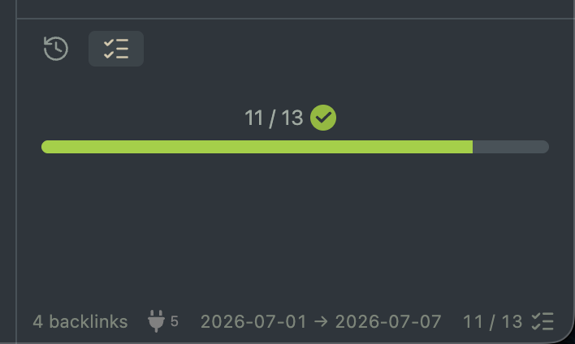

# Checkbox Status for Obsidian
Shows checked and total checkbox counts in the status bar and/or a separate view.

# Commands

## Toggle checkbox status view

Toggles the separate view on/off.

# Settings

## Show in status bar

Shows the status bar item when enabled.

## Show progress bar in view

Shows a progress bar filled to `checked / total` when enabled.

## Count any non-empty checkbox as checked

Only counts [x], [X], and [ ] checkboxes when disabled. Otherwise custom checkboxes like [p] and [-] will count as checked.

# Usage

Install and enable the plugin. Only the status bar item is shown by default, but the separate view can be added with the `Toggle checkbox status view` command.
